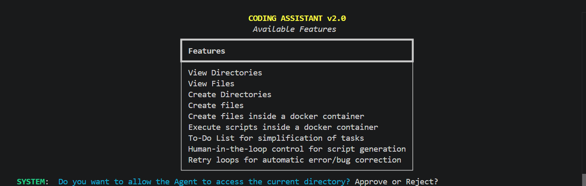
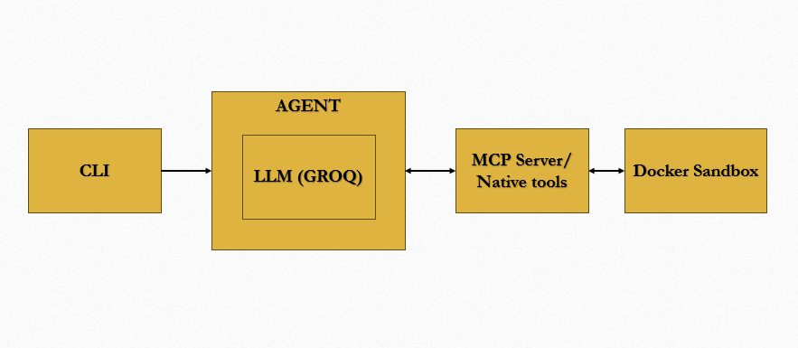

# CLI based Developer Assistant using Langchain, Langgraph, Docker and Groq along with MCP implementation 


# Overview
Coding agents tend to either run unchecked codes or require constant supervision. So this project aims for a middle ground — autonomy with low-risk, and explicit human approval on high-risk ones (creating/overwriting scripts).<br><br>
This autonomous coding assistant can plan, write, test, and debug code inside an isolated Docker sandbox. It utilizes a **LangChain agent loop**, **Model Context Protocol** (MCP) tool servers, **Docker** for the **sandbox env** and **Groq-hosted LLM inference** to deliver a reliable, and observable coding workflow — with a **human-in-the-loop** control for the actions that matter most such as local file creation.
<br>

<br>

# Key Features 

|**Feature**|**Description**|
|-------|-----------|
|View Directories | Agent can list and traverse the project's directory structure | 
|View Files | Agent can read file contents to inform its planning and edits |
|Create Directories | Agent can scaffold new folders as part of a task |
|Create Files | Agent can create new files on the host filesystem |
|Create Files Inside a Docker Container | Files can be written directly into the sandbox container, isolating generated code from the host, keeping execution safe |
|To-Do List for Task Simplification | The agent breaks a task into a smaller subtasks, working through it step-by-step rather than as one opaque action. |
|Human-in-the-Loop Control | Script creation pauses for explicit human approval before it's written locally |
|Retry Loops for Automatic Error/Bug Correction| On execution failure, the agent retries with corrected context until the script runs cleanly, without human intervention. |

Apart from the tools, <br>
    - MCP Server : every tool above is exposed via the server, making it modular and reusable outside this project. <br>
    - Groq Inference : LLM calls are served through Groq for low-latency reasoning. <br>
    - Rich Terminal UI : a live, information-dense UI displays the calls being made by the agent, retry attempts, and sandbox output as they happen. <br>
    - Docker sandbox env : ensure scripts are safe and reliable by testing inside the sandbox. <br>

# Native and MCP based Variant
**Native variant** - > Contains tools in the script <br>
**MCP based Variant** -> Uses a MCP server to expose the tools 

|**Function**|**Native variant**|**MCP based Variant** (/MCPBased)|
|------|-------|-----------|
|Coupling | Tightly coupled | Decoupled | 
|Reusability | Tools are tied to the script | any MCP-compatible client can use |
|Complexity | Simpler | More setup required |

Functionally, both variants support the same feature list. The difference is purely architectural, in how the agent discovers and calls its tools.

# Architecture



# Tech Stack
|**Component**|**Technology**|
|-------|-----------|
| Agent | Langchain and Langgraph | 
| MCP | FastMCP |
| LLM Inferencing | Groq |
| Sandbox creation | Docker |
| Terminal UI | Rich |

# Setup and Usage

## Prerequisites
**Docker** installed and running <br>
A **Groq API key** present in .env

## Installation
```bash
git clone https://github.com/SivaKumarPalanirajan/CLI-based-Developer-Assistant
cd CLI-based-Developer-Assistant
pip install -r requirements.txt
```

## Build docker image
```bash
docker build -t python_sandbox -f dockerfile.sandbox
```

## Run the docker container 
```bash
docker run -d -p 50:8080 --name python-sandbox python_sandbox
``` 

## Execution of Native variant
```bash
python app.py
```

## Execution of MCP based variant
```bash
cd MCPBased
python app.py
```

